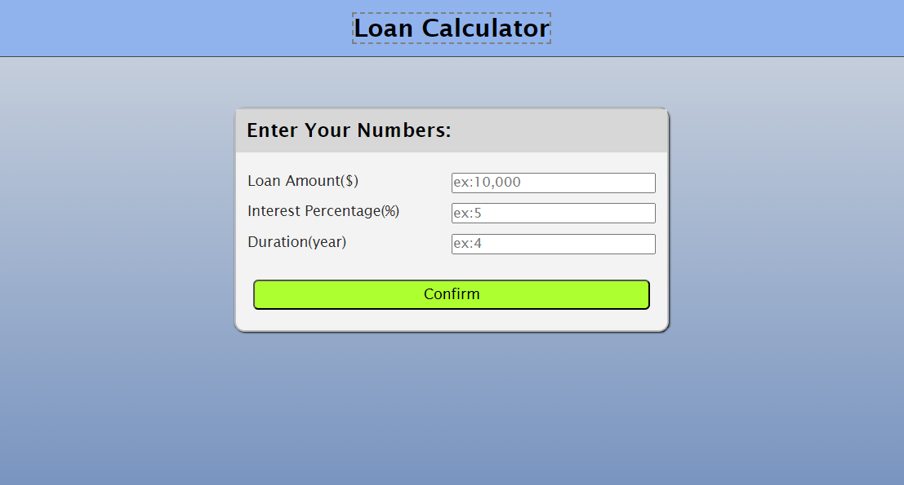
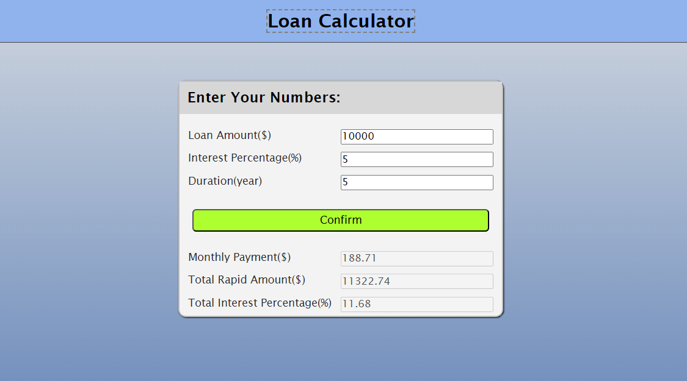

# Loan Calculator

Pure javascript project for claculating loan.

### Visit Site

Share your feedback to me - [Loan-Calculator](https://jaywalk1414.github.io/js-loan-calculator/)

## Table of Contents
* [Project Status](#project-status)
* [Features](#features)
* [Screenshots](#screenshots)
* [Technologies](#technologies)
* [Contact](#contact)
* [License](#license)

## Project Status
This project is currently: _Active_

## Features
Complete:
* Users can enter a loan amount, interest rate, and years to repay
* Checking inputs and shows error for invalid one
* Loading animation displays upon submission for calculating amounts completely
* Finaly displays the results for monthly payment, total payment, and total interest

Under progress:
* Improving user interfaces

## Screenshots

## Technologies
Built with:
* HTML
* CSS
* JavaScript

## Contact

Twitter - [@DarkSuitOwl](https://twitter.com/DarkSuitOwl)

## License
**MIT License**: 
A short and simple permissive license with conditions only requiring preservation of copyright and license notices. Licensed works, modifications, and larger works may be distributed under different terms and without source code.

  
